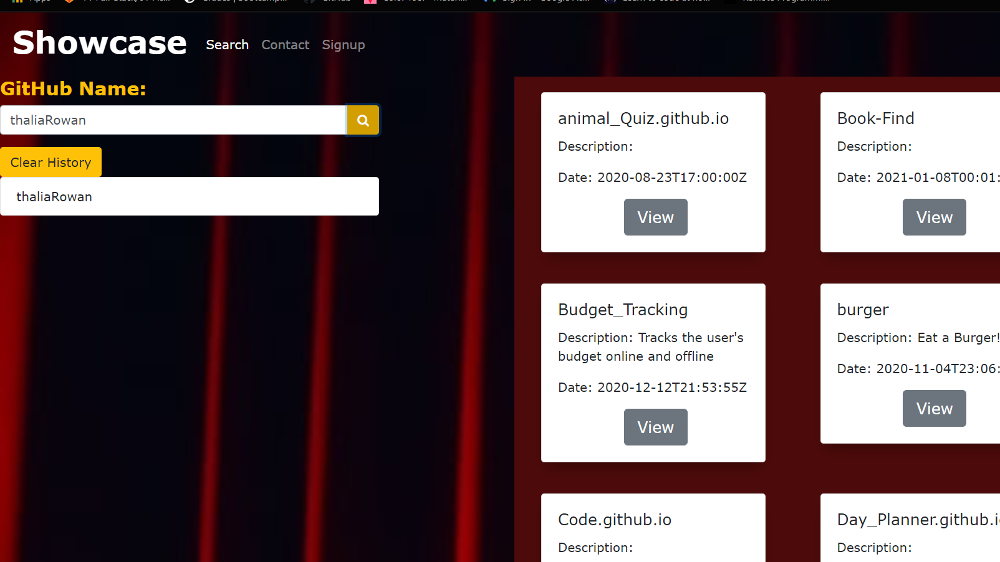

# SHOWCASE

## Description
ShowCase works by accepting a GitHub user name and produce a timeline containing each repo with its respective the repo names, the date they were created, and their descriptions.
 The ShowCase App major function is to make access  to portfolio information of prospective Tech employees   easier by providing brief and comprehendable details to recruitment teams and prospective employers who are the primary users of theShowcase App.

## Technologies used
* Github API
* React
* Express
* Cors
* MySql
* Sequelize

## Image of deployed application

## Deployed Application

https://infinite-retreat-96056.herokuapp.com/
